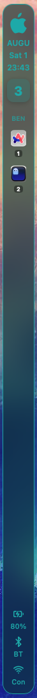

# Übersicht SideBar Widget




A sleek, event-driven, zero-polling workspace widget built for [Übersicht](https://github.com/felixhageloh/uebersicht) on macOS. **Best compatible with [AeroSpace](https://github.com/nikitabobko/AeroSpace)** tiling window manager. It supports multi-monitor tracking, instant app-icon caching, and has been aggressively optimized to consume virtually 0% idle CPU.

## ✨ Features
- **AeroSpace Integration**: Instantly tracks workspaces and active windows across multiple monitors.
- **Auto App Icons**: Automatically extracts `.icns` from macOS apps and builds a local `.png` cache on the fly.
- **Optimized Performance**: 0% idle CPU. No background React polling. Updates are strictly pushed via OSAScript hooks.
- **Hardware Metrics**: Shows battery level, charging status, Wi-Fi status, and smart audio device detection (Speakers vs AirPods/Headphones).

## 📋 Prerequisites

Before installing the widget, make sure you have the following:

### 1. Auto-Hide the macOS Menu Bar
The widget is designed for a clean, full-edge desktop. **Auto-hide your menu bar** for the best experience:
- Open **System Settings → Control Centre → Automatically hide and show the menu bar** → Set to **Always**.

### 2. Auto-Hide the macOS Dock
Similarly, **auto-hide your Dock** so it doesn't overlap with the sidebar:
- Open **System Settings → Desktop & Dock → Automatically hide and show the Dock** → Toggle **On**.

### 3. Install AeroSpace (via Homebrew)
This widget relies on the [AeroSpace](https://github.com/nikitabobko/AeroSpace) tiling window manager. Install it with [Homebrew](https://brew.sh/):
```bash
brew install --cask nikitabobko/tap/aerospace
```
> **Note:** The widget expects AeroSpace at `/opt/homebrew/bin/aerospace` (the default Homebrew location on Apple Silicon). If you're on an Intel Mac, you may need to update the path in `index.jsx`.

### 4. Install Übersicht
Download and install [Übersicht](https://github.com/felixhageloh/uebersicht) if you haven't already.

## 🚀 Installation

1. Clone this repository directly into your Übersicht widgets folder:
   ```bash
   cd ~/Library/Application\ Support/Übersicht/widgets/
   git clone https://github.com/GranthikSom/Sidebar SideBar.widget
   ```
   > **Important:** The folder must be named `SideBar.widget` for Übersicht to recognize it.

2. Update your `~/.aerospace.toml` config to trigger the widget instantly on workspace or focus changes. Add these lines:
   ```toml
   exec-on-workspace-change = ['bash', '-c', 'exec-and-forget osascript -e "tell application \\"Übersicht\\" to refresh widget id \\"SideBar-widget-index-jsx\\""']
   on-focus-changed = ['exec-and-forget osascript -e "tell application \\"Übersicht\\" to refresh widget id \\"SideBar-widget-index-jsx\\""']
   ```

3. **That's it!** The widget will automatically appear on the left edge of your screen and instantly update whenever you switch workspaces, change window focus, or change your hardware state (battery, Wi-Fi, audio).

---

## ⚡ The Optimization Architecture

To keep this widget instantaneous, several extreme optimizations were applied. **Do not undo these if you fork.**

### 1. No Background Polling (Event-Driven)
Ubersicht's native polling (`refreshFrequency = 10000`) is completely disabled (`refreshFrequency = false;`). 
Instead, updates are triggered **exclusively** via the AeroSpace OSAScript callbacks above.

### 2. Single-Process Execution
The widget executes exactly **one** shell string (`const CMD = ...`) to gather all data (Workspaces, Windows, Wi-Fi, Audio, Battery). 

### 3. Native V8 Regex Parsing
Instead of using slow `awk`/`sed`/`grep` in bash or expensive `.includes()` chaining in JS, the widget uses raw pre-compiled JavaScript Regular Expressions.

### 4. Zero-Block DOM Caching
The widget never relies on `` `onError` handlers, which notoriously block the main React thread. Instead, it reads the `icons/` directory into a global JavaScript `Set()` on startup, and dynamically generates missing icons in the background via `generate_icon.sh`.

### 5. Static Emotion CSS
All `css({...})` function calls have been extracted *outside* of the React `render()` function to bypass Emotion's expensive render-loop object hashing.

---

## 🛠️ Customization

### Moving the Widget
To move the widget to the right side of the screen, open `index.jsx` and look for the `export const className` block at the top. Change `left: "10px"` to `right: "10px"`.

### Adding a New Audio Device (e.g. New AirPods)
If you buy new headphones and they show up as the "Speaker" icon, check the output of `SideBar.widget/audio_device`. 
Then, open `index.jsx` and add a unique keyword from that output into the regex parser:
```javascript
// Find this line:
} else if (/airpods|bluetooth|bose|sony|beats|buds|ear|pod/.test(audioRaw)) {
// Add your new keyword:
} else if (/airpods|bluetooth|bose|sony|beats|buds|ear|pod|sennheiser/.test(audioRaw)) {
```

### Changing Colors
All colors are globally defined as `css({...})` blocks or explicitly written in the `style={{}}` tags. Search `index.jsx` for `#00b3b3` (Cyan) and replace it with your desired hex code. Ensure you update the `@keyframes blinkFlash` block as well.
